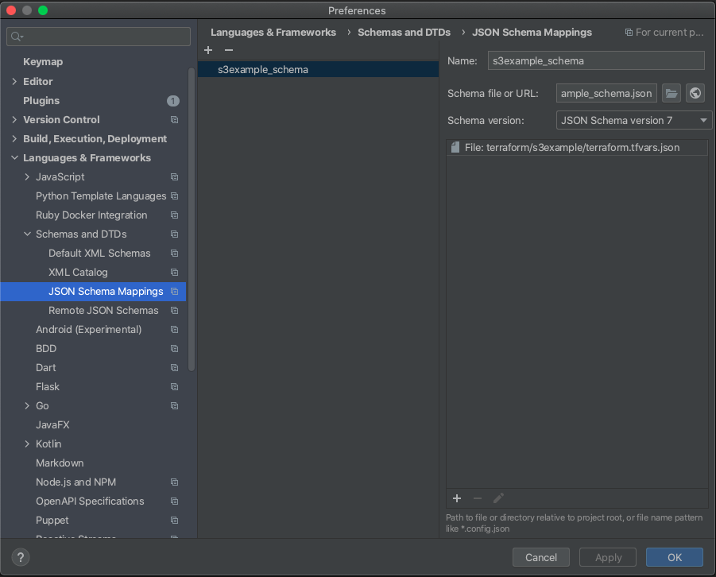

# Terraform Json Schema Input Validation Example

This example project provides a way to do Terraform module input validation using standard `Json Schema` validation. 

## Motivation 
The motivation for doing this is that the recently released Terraform .13 variable 
[validation rules](https://www.terraform.io/docs/configuration/variables.html#custom-validation-rules) provides a non-standard
method of validating inputs with the following drawbacks!
 
 * Poorly documented with limited examples.
 * Validation rules for Complex Types (List, Maps, Objects) is not possible or results in obscure rules.
 * Violates DRY. Logic in rules is not reusable across variables, modules and projects. 
 * Error messages don't support interpolations. Results in ambiguous errors with Complex Types (List, Maps, Objects).
 
 
## Why Json Schema?

[Json Schema](https://json-schema.org/) is a widely adopted standard with significant existing tooling in multiple languages.
It provides a more general purpose and expressive way of validation that addresses all the concerns in the 
[Motivation](#motivation) section and provides the following benefits.

 * Published Schema can be used by other upstream applications (UI, CI/CD ...) or teams.
 * Can be used to generate code or documentation.
 * [IDE integration](#ide-integration) such as Intellij provides validation and IntelliSense.
 * More expressive validation.
   
   
## How Its Implemented 
The current implementation takes advantage of the [External Data Source](https://registry.terraform.io/providers/hashicorp/external/latest/docs/data-sources/data_source)
and NodeJs [Ajv](https://ajv.js.org/) (Another Json Validator) lib. This could easily be substituted for Python or some 
other language. All the Terraform input variables are passed to the query as a json encoded value. The schema is read in
by Terraform file() function and passed to the query as schema. 

The program in this case Nodejs runs the [validate.js](./validation/src/validate.js) which is a thin wrapper around Ajv.
Validate.js reads the query variables off the stdin and writes any validation errors on stderror or and empty json object 
if there are no errors.

 

## IDE Integration
Intellij has excellent Json Schema integration. It can be configured to use remote schemas and to bind a particular 
schema to either a file, file pattern or a directory. In the example below the schema 
[s3example_schema.json](./terraform/s3example/s3example_schema.json) is bound to the 
[terraform.tfvars.json](./terraform/s3example/terraform.tfvars.json). This setup allows for IDE completion while authoring
the schema. It provides completions and validation in the IDE while authoring the Terraform tfvars.json input file.

Example with code completion of tfvars.json

Example with validation showing s3_bucket name as invalid because the name has _ underscores which are not a valid 
S3 bucket name and does not match the regex `"pattern": "(?!^(\\d{1,3}\\.){3}\\d{1,3}$)(^[a-z0-9]([a-z0-9-]*(\\.[a-z0-9])?)*$)"` 
defined in the schema.

## Custom Provider
Future work is to provide a custom provider that provides a data source that does not require an external process and 
provides a simpler interface 
